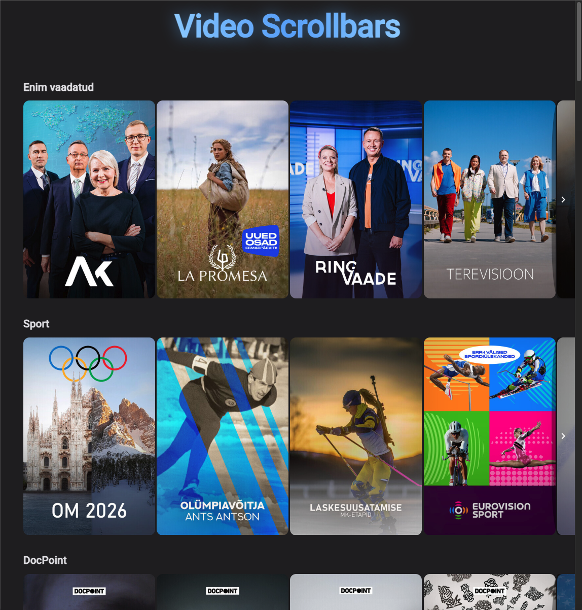

# Angular: Scalable Video Content Scrollbars ✅

**In short:** My first serious project and introduction to Angular.  
Creating a flexible, adaptive component for horizontal scrollbars / carousels to display video content (categories, thematic feeds, recommendations, etc.) with support for different screen sizes.

---

## 🚀 What the Project Does

- Adaptive horizontal scrollbars / carousels for video/image cards
- Support for different screen sizes (desktop, tablet, mobile)
- Easy integration and scalability for various UI/UX requirements

**Current Status:**  
The project already runs quite fast on good internet and a powerful machine.  
However, on slow connections (3G/Edge) and/or low-powered devices, loading can feel **jumpy** or **stuttery** — images load progressively as you scroll, with noticeable pauses if there are many carousels with dozens of cards.

**TODO / Future Improvements:**
- Implement **horizontal Virtual Scroll** (using `@angular/cdk/scrolling`) + `NgOptimizedImage`.  
  This will render **only visible cards + a few on the sides** (typically 10–20 cards in DOM instead of 100+).  
  Greatly improves performance on weak devices and long carousels.
- Add a nice border + **Shimmer animation** (loading skeleton) for better perceived performance during image loading.

## ⚙️ Requirements

- Node.js (LTS version recommended)
- npm (or pnpm / yarn)
- Angular CLI (recommended)

## Start 🧩
- npm install
- npm start

##  🚀 angular-cli-ghpages is ready!
    
    
      1. Docs: https://github.com/angular-schule/angular-cli-ghpages
      2. Deploy via: ng deploy
      3. site: https://vovaks.github.io/scrollbars-video-content/

## Screenshots

### Desktop view

